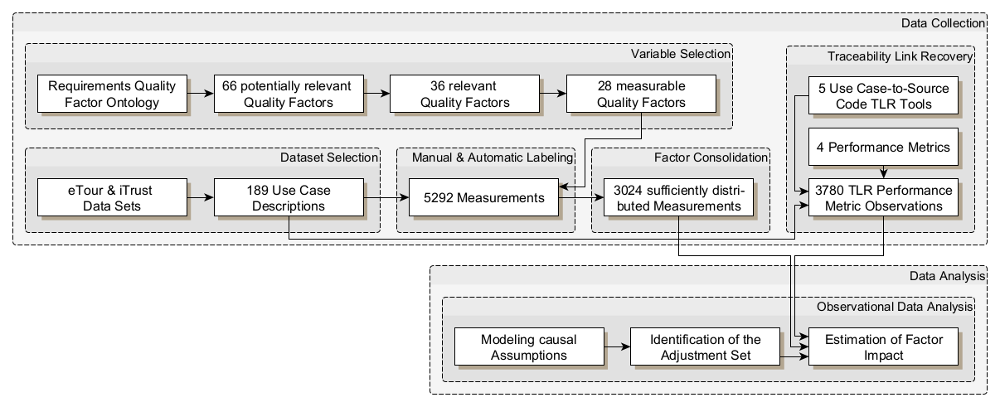

# How Requirements Quality Makes (or Breaks) Traceability Link Recovery - Replication Package
[](https://github.com/tobhey)
[](https://github.com/JulianFrattini)
[](./LICENSE.md)
[](https://doi.org/10.5281/zenodo.20479037)

## Summary of Artifact
This repository contains the replication package for the study on how requirements quality affects the performance of automatic traceabitlity link recovery tools.
Our objective is to contribute empirical evidence on this impact.
At the same time, we aim to understand how the performance of Traceability Link Recovery approaches varies given quality defects.
In the scope of this study, we address the questions "Which factors of requirements quality impact the per-
formance of automated traceability link recovery?" and "Do different approaches for automated traceability link
recovery respond differently to these factors?"



This artifact accompanies the paper "How Requirements Quality Makes (or Breaks) Traceability Link Recovery" and contains the data, code, and analysis notebooks required to inspect and reproduce the reported findings.

Expected inputs:

1. Quality-factor labels and merged metadata in [data](./data).
2. TLR output files in [data/TLR_results](./data/TLR_results).
3. Analysis notebooks in [analysis](./analysis).

Expected outputs:

1. Prepared analysis dataset: [analysis/data/rq4tlr-data.csv](./analysis/data/rq4tlr-data.csv).
2. Posterior estimate exports in [analysis/data/estimates](./analysis/data/estimates).
3. Generated figures in [figures/results](./figures/results).
4. Rendered notebooks in [analysis/html](./analysis/html).


## Description of Artifact

This repository consists of the following files.

```
├── analysis : directory containing all files for the final data analysis
│   ├── data
│   │   ├── estimates : outputs produced during the data analysis
│   │   └── rq4tlr-data.csv : data parsed into a format usable for the final data analysis
│   ├── experimental/experimental-analysis.Rmd : multivariate regression analysis on the experimental data
│   ├── html : directory containing all pre-compiled data analysis notebooks
│   ├── observational : directory containing all regression analysis on the observational data
│   │   ├── observational-analysis-x.Rmd : observational analysis of all variables per outcome
│   │   └── interaction-approach-x.Rmd : interaction analysis between approach and variable x
│   └── util : utility notebooks for the analysis workflow
│       ├── conditional-inconsistentloa-outlinks-size.Rmd : conditional-effects analysis
│       ├── dag.Rmd : specification of the causal assumptions
│       ├── data-preparation.Rmd : compilation and casting of the final data set
│       ├── estimate-visualization.Rmd : visualization of posterior estimates
│       └── marginal-*.Rmd : marginal-effects analyses
├── data : directory containing all data collected for and produced during the study
│   ├── input : data sets composed from a series of use cases from different domains
│   │   ├── formatted : normalized source data used by the Python pipeline
│   │   ├── raw : original data as obtained from previous studies
│   │   └── supplementary : generated tables for manual labeling and inspection
│   ├── labeling/rq4tlr-manual-variables.xlsx : labels assigned manually for complex independent variables
│   ├── output/ : labels assigned automatically for simpler independent variables
│   │   ├── rq4tlr-automatic-aggregated.csv : automatically labeled variables aggregated to file-level
│   │   ├── rq4tlr-automatic-sentence.csv : automatically labeled variables on sentence-level
│   │   ├── rq4tlr-automatic-subflow.csv : automatically labeled variables on subflow-level
│   │   ├── rq4tlr-automatic-usecase.csv : automatically labeled variables on usecase-level
│   │   ├── rq4tlr-merged.csv : merged data from automatically and manually labeled variables
│   │   └── variables.json : specification of variable names
│   └── TLR_results : results from the different TLR approaches on the data set
├── doc/Extraction Guidelines.pdf : codebook for extracting manual quality factors
├── figures : directory for all additional documentation
│   ├── distributions : visualization of the distribution of factors in the data
│   ├── graphs/rq4tlr-study-overview.graphml : visualization of the study process
│   └── results : 
│       ├── coefficients : visualization of coefficient CIs from posterior distributions
│       ├── conditional : visualization of conditional effects
│       └── marginal : visualization of marginal effects
├── src : directory containing all source code
└── requirements.txt : specification of required Python libraries
```

Important subcomponents:

1. [analysis/util/data-preparation.Rmd](./analysis/util/data-preparation.Rmd): merges independent and dependent data into [analysis/data/rq4tlr-data.csv](./analysis/data/rq4tlr-data.csv).
2. [analysis/observational](./analysis/observational): Bayesian observational analyses per metric and interaction analysis notebooks.
3. [analysis/experimental/experimental-analysis.Rmd](./analysis/experimental/experimental-analysis.Rmd): experimental analysis notebook.
4. [analysis/util/estimate-visualization.Rmd](./analysis/util/estimate-visualization.Rmd): builds coefficient visualizations from estimate CSV outputs.
5. [src/README.md](./src/README.md): Python-side parsing and preprocessing documentation.


The datasets used in this study stem from the repository [tobhey/**finegrained-traceability**](https://github.com/tobhey/finegrained-traceability). 

## System Requirements

To run the processing steps implemented using Python, consider the [README file in the src directory](./src/README.md) which contains both system requirements and usage instructions.

To run the data analysis scripts implemented in R, ensure that you have [R](https://ftp.acc.umu.se/mirror/CRAN/) (version > 4.0) and an IDE like [RStudio](https://posit.co/download/rstudio-desktop/#download) installed on your machine. 


## Installation Instructions

Install from scratch:

1. Clone the repository and move to the project root.
2. Install the C toolchain by following the instructions for [Windows](https://github.com/stan-dev/rstan/wiki/Configuring-C---Toolchain-for-Windows#r40), [Mac OS](https://github.com/stan-dev/rstan/wiki/Configuring-C---Toolchain-for-Mac), or [Linux](https://github.com/stan-dev/rstan/wiki/Configuring-C-Toolchain-for-Linux) respectively.
3. Restart RStudio and follow the instructions starting with the [Installation of RStan](https://github.com/stan-dev/rstan/wiki/RStan-Getting-Started#installation-of-rstan).
4. Install the latest version of `stan` by running the following commands
```
    install.packages("devtools")
    devtools::install_github("stan-dev/cmdstanr")
    cmdstanr::install_cmdstan()
```
5. Install all required packages via `install.packages(c("tidyverse", "xlsx", "ggdag", "brms", "marginaleffects", "patchwork", "RColorBrewer"))`.
6. Create a folder called *fits* within the *analysis* directory such that `brms` has a location to place all Bayesian models.
7. Open the `rq4tlr.Rproj` file with your IDE, which will setup the environment correctly.

## Usage Instructions
To reproduce the study that this replication package accompanies, we recommend the following steps:

1. **Review the causal assumptions**: The file [analysis/util/dag.Rmd](./analysis/util/dag.Rmd) specifies all of our causal assumptions under which we investigate the phenomenon of interest in our study.
2. **Inspect the data**: The [data-preparation.Rmd](./analysis/util/data-preparation.Rmd) loads and assembles our data for analysis.
3. **Follow the observational analyses**: The analyses contained in [analysis/observational/](./analysis/observational/) contain a step-wise description of the Bayesian regression analyses.
4. **Follow the experimental analysis**: The file [experimental-analysis.Rmd](./analysis/experimental/experimental-analysis.Rmd) describes the experimental analysis performed subsequently to the observational analyses.
5. **Assemble the results**: The file [estimate-visualization.Rmd](./analysis/util/estimate-visualization.Rmd) produces the core result of our study, the plot visualizing significant posterior distributions.

For all `.Rmd` files, there is also a precompiled `.html` file in [analysis/html/](./analysis/html/) to ease their access.
When compiling the data analysis notebooks yourself, keep in mind that training Bayesian models may take several minutes.

Command-line runner behavior:

1. Each notebook can be rendered in RStudio or via `rmarkdown::render("path/to/notebook.Rmd")`.
2. Generated HTML files are written to [analysis/html](./analysis/html) when rendered to that location.
3. Generated figures are written to [figures/results](./figures/results).

Reuse guidance for non-executable material:

1. The extraction/codebook document in [doc](./doc) can be reused for qualitative labeling protocols.
2. Input/output datasets in [data](./data) can be reused for benchmarking or secondary analysis.

## Steps to Reproduce

### Full regeneration path (computationally expensive)

1. Install dependencies following the Installation Instructions.
2. Run [analysis/util/data-preparation.Rmd](./analysis/util/data-preparation.Rmd).
3. Run all notebooks in [analysis/observational](./analysis/observational).
4. Run [analysis/experimental/experimental-analysis.Rmd](./analysis/experimental/experimental-analysis.Rmd).
5. Run [analysis/util/estimate-visualization.Rmd](./analysis/util/estimate-visualization.Rmd) and related utility notebooks.
6. Verify generated artifacts in [analysis/html](./analysis/html), [analysis/data/estimates](./analysis/data/estimates), and [figures/results](./figures/results).

## Known Deviations

1. Numeric differences in posterior summaries can occur across operating systems, compiler toolchains, and package patch versions.
2. Re-rendered notebook HTML files may differ in metadata/timestamps while preserving substantive results.

## Reuse with other Data Sets and TLR Approaches

This artifact is not limited to the data sets and traceability link recovery approaches included in this repository. The workflow can be reused with additional inputs as long as they are mapped to the expected interfaces of the parsing, processing, and analysis pipeline.

1. **Other data sets**: New requirements data sets can be incorporated by implementing or adapting parsers in [src/parsers](./src/parsers) so that the raw inputs are transformed into the normalized intermediate representation consumed by the Python pipeline. The resulting normalized files are stored in [data/input/formatted](./data/input/formatted) and can then be processed using the existing scripts documented in [src/README.md](./src/README.md).
2. **Other TLR approaches**: Additional traceability link recovery approaches can be evaluated by exporting their results into the schema expected in [data/TLR_results](./data/TLR_results). Once these outputs follow the repository's naming and column conventions, they can be merged with the independent variables and reused in the downstream analysis notebooks.

For both reuse scenarios, the stable handoff points are the normalized input files in [data/input/formatted](./data/input/formatted), the merged variable tables in [data/output](./data/output), the TLR result files in [data/TLR_results](./data/TLR_results), and the prepared analysis data set in [analysis/data/rq4tlr-data.csv](./analysis/data/rq4tlr-data.csv).

## Artifact Location

Primary immutable artifact location:

1. DOI: https://doi.org/10.5281/zenodo.20479037

Project source location:

1. Repository: https://github.com/JulianFrattini/rq4tlr

## Authors Information

Authors:

1. Tobias Hey
   [](https://orcid.org/0000-0003-0381-1020)
   [](https://github.com/tobhey)
2. Julian Frattini
   [](https://orcid.org/0000-0003-3995-6125)
   [](https://github.com/JulianFrattini)

If you use this artifact in your research, please cite:

```bibtex
@inproceedings{hey_frattini_2026_rq4tlr,
  title={How Requirements Quality Makes (or Breaks) Traceability Link Recovery},
  author={Hey, Tobias and Frattini, Julian},
  booktitle={2026 34th IEEE International Requirements Engineering Conference (RE)},
  year={2026},
  organization={IEEE}
}
```

For machine-readable citation information, please refer to the [CITATION.cff](./CITATION.cff) file in this repository.

## License

This artifact is available under the MIT License in [LICENSE.md](./LICENSE.md).
