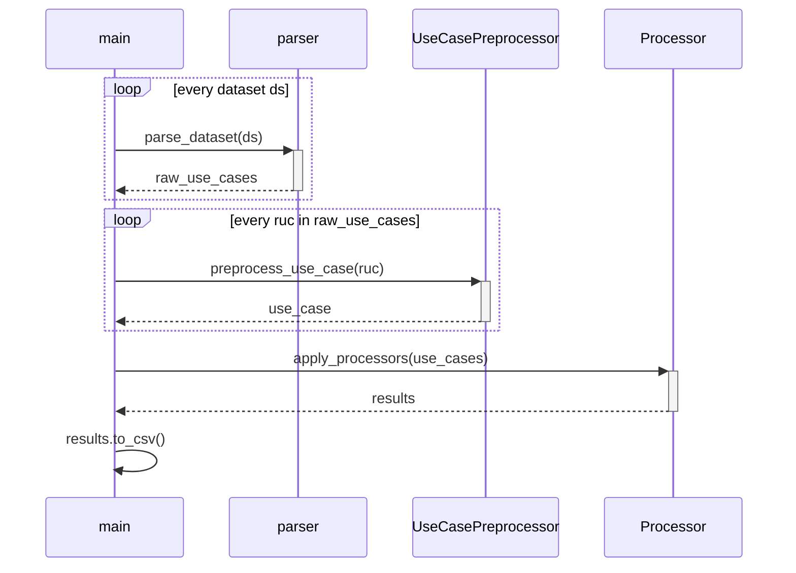

# Automatic Analysis

This sub-directory contains the implementation of the automatic analysis of use cases.
The automatic analysis aims to evaluate the use cases regarding those factors which can be decided automatically.

## Process

The core of the automatic analysis is the [main.py](src/main.py) script which ties all sub-scripts together. 
Its essential interface is:

- **Input**: a list of use cases in text files, located in the [data/input/](data/input) directory
- **Output**: a `CSV` file where each use case from the input is associated with values for all automatically decided factors

The `main.py` script delegates this task as follows:



The individual components (e.g., the parser, preprocessor, and processor) delegate their task further.

## System Requirements

Before running the automatic analysis, ensure that [Python 3.10](https://www.python.org/downloads/release/python-3100/) and [pip](https://pypi.org/project/pip/) are available on your machine.
Then, execute the following steps:

1. Optionally, create a virtual environment via `python -m venv .venv` and activate it via `.venv\Scripts\activate`
2. Install the necessary requirements via `pip install -r requirements.txt`
3. Install the spaCy language model via `python -m spacy download en_core_web_sm`

Afterwards, you can continue with the usage of the analysis.

## Usage

To execute the automatic analysis, run the `main.py` script, e.g., via `python .\main.py`.
In case you installed the dependencies into a virtual environment, ensure that it is running.

## Development

To contribute to the automatic analysis, please consider the following recommendations.

### Developing a new Parser

In case you want the automatic analysis to handle a new data set where the text files of the use cases do not follow any existing template, you need to develop a new parser.
The parser must extend the `AbstractUseCaseParser` class, the specification of which can be found in the [usecaseparser.py](parser/usecaseparser.py) file.
Then, append a tuple consisting of the data set `name` and an object of the respective parser subclass to the `parsers` attribute in the `main.py` file.

```Python
parsers = [
    ('eTour', EtoursParser()), 
    ('iTrust', ItrustParser()),
+    ('<new dataset name>', NewParser())
]
```

The next execution of the `main.py` script will then include the new data set.

### Adding a Preprocessor Step

In case a [new processor](#adding-a-new-factor-processor) requires additional preprocessing steps, you need to create a new preprocessor.
First, determine the type of information that the sentence-level preprocessor creates.
Add this information as an attribute to the `sentence` data class in the [sentence.py](./src/util/sentence.py) file.
Then, create a new method in the [preprocessor.py](./src/preprocessor/preprocessor.py) script (this file already has the English language model for `spaCy` loaded).
Finally, call the preprocessing step in the `preprocess_sentence()` method and add the new information to the preprocessed sentence object.

```python
# Perform POS tagging
pos_tagged = self.pos_tagging(literal)

+ # perform the new preprocessing step
+ new_preprocessing_product = self.preprocessing_method(literal)

# Create the sentence object
preprocessed: sentence = sentence(
    literal=literal, 
    pos_tagged=pos_tagged
+    new_preprocessing_attribute=new
)
```

### Adding a new Factor Processor

To implement the automatic analysis of a new factor, you need to develop a new processor.
Create a new file for the new processor in the [processor](src/processor/) subdirectory.
The files for processors follow a naming convention depending on the output type of the factor.

| Prefix | Data type | Example |
|---|---|---|
| `detect` | Boolean | [detect_happy_ucs.py](src/processor/detect_happy_ucs.py) |
| `calc` | Numeric | [calc_large_ucs.py](src/processor/calc_large_ucs.py) |

The new file needs to contain a class that extends the `AbsProcessor` class specified in the [absprocessor](src/processor/absprocessor.py) file.
As such, it needs a `name` attribute and a `process()` function.
Once implemented, add it to the processor by extending the `__init__` function of the [processor](src/processor/processor.py):

```python
def __init__(self):
    # setup all available processors
    self.processors: list[AbsProcessor] = [
        DetectHappyUCs(),
        CalculateLargeUseCases(),
+       NewProcessor()
    ]
```

The next execution of `main.py` will execute the additional processor and add a column with the given `name` to the resulting table.
