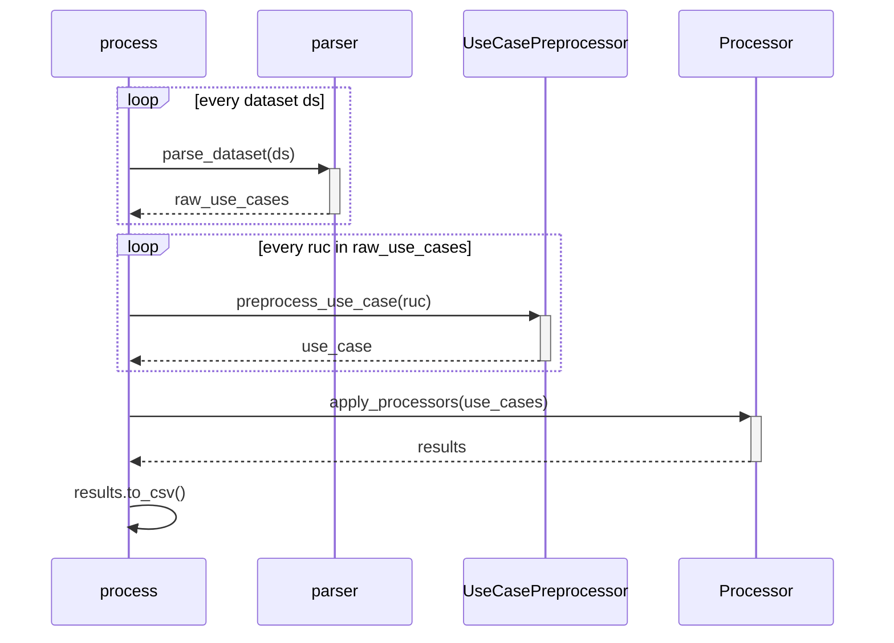

# Automatic Analysis

This sub-directory contains all executable scripts as well as utility scripts for several use cases.

## Structure

This directory contains the following files.

```
├── parsers : directory for parsers from text files to use case objects
│   ├── etoursparser.py : text file parser for the etours data set
│   ├── itrustparser.py : text file parser for the itrust data set
│   └── usecaseparser.py : abstract parser class which all parsers must extend
├── preprocessor : directory for preprocessing steps
│   ├── preprocessor.py : sentence-level NLP steps
│   └── uc_preprocessor.py : use-case-level NLP steps
├── processor : directory for processing steps, i.e., implementation of quality factors
│   ├── absprocessor.py : abstract processor class which must be extended by all actual processors
│   ├── processor.py : central processor that applies all quality factors
│   └── (processors) : implementation of the processors
├── structure : directory for definition of classes
│   ├── rawusecase.py : definition of the RawUseCase class
│   ├── sentence.py : definition of the Sentence class
│   └── usecase.py : definition of the UseCase class
├── util : directory for utility scripts
│   ├── loader.py : script that loads all use case text files from a directory
│   ├── readfile.py : script that reads a text file from the disc
│   └── static.py : collection of static variables like file paths
├── disagreements.py : script that detects disagreements between two ratings
├── get_item_list.py : script that generates a table of indices from the raw data
├── merge_data.py : script that merges generated data tables and harmonizes columns
├── parse.py : script to parse the raw use case text files into Python objects
├── process.py : script to evaluate quality factors on preprocessed use cases
└── vizualization.ipynb : interactive notebook visualizing the raw data
```

## Executables

On the highest level, it contains the following executable scripts:

| Script | Purpose | Description |
|---|---|---|
| `disagreements.py` | Detects disagreements between two manual ratings | [Disagreements](#disagreements) |
| `get_item_list.py` | Generates a tables of indices from the raw data set | [Get Item List](#get-item-list) |
| `parse.py` | Parses all text files into a common format | [Parse](#parse) |
| `process.py` | Processes the parsed use cases | [Process](#process) |
| `merge_data.py` | Merge all data sets with independent variables together | [Merge](#merge) |

The subsequent sections describe each executable in detail. 
Consider the [system requirements](#system-requirements) for running the scripts.

Run all executable commands in this README from within the `src/` directory. The imports are standardized for src-local execution (e.g., `python process.py --level all` from `src/`).

### Disagreements

The `disagreements.py` script detects and prints all disagreements between the manual ratings of two raters.
To execute it, run:

```
python disagreements.py --level <requirements/sentences>
```

The output is empty if there are no disagreements.
Otherwise, the script prints all disagreements to the console.

### Get Item List

The `get_item_list.py` script generates a table of indices for each item in the raw dataset.
This output can be used for manual labeling, as it produces a raw list where each item (i.e., use case or sentence within use case descriptions) occupies one row.
The script can be executed via the following command:

```
python get_item_list.py --dataset <etour/itrust> --level <requirement/sentence>
```

Depending on the `level` argument, the script will create a table in the data/input/supplementary/ directory.
For the configurations `--dataset etour` and `--level sentence`, the head of the table looks as follows:

| UC | Subflowtype | Subflow | File | Line |
|---|---|---|---|---|
| 1 | 1 | 0 | UC1 | 1 |
| 1 | 1 | 0 | UC1 | 2 |
| 1 | 1 | 0 | UC1 | 3 |
| 1 | 1 | 0 | UC1 | 4 |
| 2 | 1 | 0 | UC2 | 1 |
| ... | | | | |

In this table, every sentence from the eTour data set is represented in one row.

### Parse

The `parse.py` script reads the raw use case text files, parses them into `RawUseCase` structures (defined in [rawusecase.py](./structure/rawusecase.py)), and stores them as `json` files in the `data/input/formatted/` directory.
To execute the parser, run the following command in an environment that has all `requirements.txt` installed:

```
python parse.py --dataset <etour/itrust>
```

The resulting json files are the input for further processing steps.

### Process

The `process.py` script processes the prepared requirements (in their `RawUseCase` format) and evaluates the quality factors on them.
The high-level interface of the script is the following:

- **Input**: a list of use cases in `json` files following the `RawUseCase` format, located in the [data/input/formatted](../data/input/formatted) directory
- **Output**: a `CSV` file where each use case from the input is associated with values for all automatically decided factors

#### Overview

The `process.py` script delegates this task as follows:



The individual components (e.g., the parser, preprocessor, and processor) delegate their task further.

#### Usage

To execute the automatic analysis, run the `process.py` script with the `--level` (or `-l`) flag set to either a specific level ("usecase", "subflow", "sentence") or to "all" to run the full analysis.

```
python process.py --level <usecase, subflow, sentence, all>
```

In case you installed the dependencies into a virtual environment, ensure that this virtual environment is running.

#### Development

To contribute to the automatic analysis, please consider the following recommendations.

##### Adding a Preprocessor Step

In case a [new processor](#adding-a-new-factor-processor) requires additional preprocessing steps, you need to create a new preprocessor.
First, determine the type of information that the sentence-level preprocessor creates.
Add this information as an attribute to the `sentence` data class in the [sentence.py](./structure/sentence.py) file.
Then, create a new method in the [preprocessor.py](./preprocessor/preprocessor.py) script (this file already has the English language model for `spaCy` loaded).
Finally, call the preprocessing step in the `preprocess_sentence()` method and add the new information to the preprocessed sentence object.

```diff
# Perform POS tagging
pos_tagged = self.pos_tagging(literal)

+ # perform the new preprocessing step
+ new_preprocessing_product = self.preprocessing_method(literal)

# Create the sentence object
preprocessed: sentence = sentence(
    literal=literal, 
    pos_tagged=pos_tagged
+    new_preprocessing_attribute=new
)
```

##### Adding a new Factor Processor

To implement the automatic analysis of a new factor, you need to develop a new processor.
Create a new file for the new processor in the [processor](./processor/) subdirectory.
The files for processors follow a naming convention depending on the output type of the factor.

| Prefix | Data type | Example |
|---|---|---|
| `detect` | Boolean | [detect_happy_ucs.py](./processor/uc/detect_happy_ucs.py) |
| `calc` | Numeric | [calc_large_ucs.py](./processor/uc/calc_large_ucs.py) |

The new file should be located in the subfolder that corresponds to its level (e.g., use case or sentence).
The new file needs to contain a class that extends the respective abstract class of its level (e.g., [ucprocessor.py](./processor/uc/ucprocessor.py) for use case level processors).
Additionally, every processor needs a `name` attribute and a `process()` function.
Once implemented, add it to the respective list of processors by extending the `__init__` function of the [processor](./processor/processor.py):

```diff
def __init__(self):
    # setup all available processors
    self.processors_uc: list[AbsProcessor] = [
        DetectHappyUCs(),
        CalculateLargeUseCases(),
+       NewProcessor()
    ]
```

The next execution of `process.py` will execute the additional processor and add a column with the given `name` to the resulting table.

### Merge

The `merge_data.py` script reads all data sets containing independent variables, merges them together, and harmonizes the column names using the [variables.json](./../data/output/variables.json) overview.

```
python merge_data.py
```

The resulting `rq4tlr-merged.csv` file will be placed in the output folder.

## System Requirements

Before running any script, ensure that [Python 3.10](https://www.python.org/downloads/release/python-3100/) and [pip](https://pypi.org/project/pip/) are available on your machine.
Then, execute the following steps:

1. Optionally, create a virtual environment via `python -m venv .venv` and activate it using the command for your shell
2. Install the necessary requirements via `pip install -r requirements.txt`
3. Install the spaCy language models used by this project:
    - `python -m spacy download en_core_web_sm` (used by the iTrust parser)
    - `python -m spacy download en_core_web_md` (used by preprocessing and sentence processors)

Afterwards, you can continue with the usage of the scripts.
